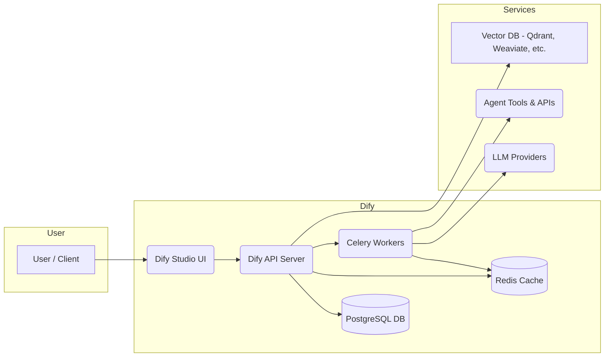

# Dify AI Platform: Comprehensive Analysis

## Executive Summary  
Dify is an **open-source AI workflow platform** for building chatbots, agents, and multi-step applications【5†L339-L342】【63†L156-L160】. It provides a **visual, low-code interface** (drag-and-drop canvas) that enables even non-technical users to construct complex AI workflows quickly【63†L156-L160】【63†L244-L252】.  Key capabilities include:
- **Multi-LLM Support:** Integration with 100+ models (GPT, Llama, Mistral, etc.) via dozens of providers【41†L379-L387】.  
- **RAG/Knowledge Pipelines:** Built-in document ingestion and vector search for retrieval-augmented generation【41†L391-L398】【47†L84-L92】.  
- **Agent Framework:** Function-calling/ReAct agents with 50+ prebuilt tools (e.g. Google Search, DALL·E)【41†L395-L400】.  
- **Backend-as-Service:** Every workflow can be published as a REST API or web app【55†L139-L147】.  
- **Observability:** Built-in logging and monitoring (LLMOps dashboards) for performance and cost tracking【41†L400-L405】.  
Dify is available as **Dify Cloud** (hosted SaaS with free sandbox credits and paid plans), a free **Community Edition** (self-host Docker/Kubernetes), and an **Enterprise Edition** with multi-tenant management and support【36†L409-L417】【60†L159-L164】.  In practice, enterprises have rapidly adopted Dify – e.g. Kakaku.com’s case study shows *75% of employees building 950 AI apps* internally within months, thanks to Dify Enterprise’s ease of use and governance【22†L242-L247】. 

## Overview  
Dify’s platform is designed to simplify AI app development for both developers and business users. Its major features are:

- **Visual Workflow Editor:** A drag-and-drop canvas where you connect nodes (LLM calls, logic, integrations) into a flow【41†L375-L383】. This eliminates boilerplate code; even non-technical users can iterate on app design【63†L156-L160】.
- **Extensive Model Library:** Support for dozens of LLM providers out-of-the-box (OpenAI, Azure, Anthropic, Hugging Face, local models, etc.)【41†L379-L387】. Workspace admins configure API keys once, then all apps can use those models.
- **Retrieval-Augmented Generation (RAG):** Native knowledge bases with ingestion pipelines. You can import documents (text, PDF, PPT, webpages) into a vector store and use **Knowledge Retrieval** nodes to supply relevant context to LLMs【41†L391-L398】【47†L84-L92】.
- **Agent & Tool Integrations:** A dedicated *Agent* node type supports function-calling and ReAct-style agents. Over 50 ready-made tools (web search, image generation, data queries, etc.) can be added as agent actions【41†L395-L400】.
- **Backend-as-a-Service (BaaS) API:** Every Dify workflow can be exposed as an API endpoint. For example, a text-generation workflow responds to POST `/v1/completion-messages`, and a chatflow to `/v1/chat-messages` with a `conversation_id`【55†L139-L147】【55†L175-L184】. Dify auto-generates API docs and credentials.
- **Multi-User Workspaces:** All resources (apps, models, knowledge bases) live in a **workspace** (team) scope【49†L84-L93】【49†L129-L138】.  Owners/Admins manage model keys, plugins, and user roles; Editors build apps; Members use published apps. Workspaces isolate data and configs across teams.
- **Monitoring and Analytics:** Built-in dashboards (or Grafana integration) show metrics like total messages, latency, and costs【41†L400-L405】【41†L463-L470】. Logging captures user inputs and LLM outputs for auditing and model optimization.

Overall, Dify offers a one-stop environment.  It abstracts away much of the plumbing (infrastructure, database, scaling) so developers can focus on designing AI workflows, while enterprise stakeholders get governance controls and analytics.

## Technical Deep-Dive  

### Architecture and Execution Model  
Dify’s architecture consists of a web-based Studio frontend, a backend API server, a database, and workers:



- **Frontend (Studio UI):** A React/Next.js app (hosted or self-hosted) for designing workflows. All node configurations and app settings are stored via the API.
- **API Server:** Typically Flask/Gunicorn. Handles workspace/user management, app definitions, and triggers executions. Also serves published APIs.
- **Workers (Celery):** Background workers execute workflows asynchronously. Each node invocation (especially LLM calls) runs in a worker process. Workers communicate via Redis (for task queue/pub-sub)【38†L281-L290】【38†L283-L292】.
- **Database/Cache:** A central PostgreSQL database holds all metadata (apps, flows, execution logs). Redis is used for caching and Celery coordination【38†L281-L290】【38†L283-L292】.
- **Model and Storage Integrations:** When a workflow runs, workers call external LLM APIs or on-prem models. Knowledge retrieval nodes query an attached vector database (e.g. Qdrant or TiDB) for semantic search【58†L149-L158】【22†L270-L279】.

This architecture scales horizontally: you can run multiple API and worker containers on Kubernetes, connect external services, and use a managed Postgres/Redis. Dify provides community Helm charts and Terraform templates for AWS/Azure/GCP deployments【41†L470-L478】. For heavy RAG usage, an external vector DB cluster is recommended; Dify’s native Qdrant integration demonstrates improved retrieval speed and scalability【58†L149-L158】.

### Nodes and Workflow Components  
In Dify, **workflows** are defined as directed graphs of *nodes*. Important node types include:

- **Start/User Input:** The entry point for a workflow. Defines the input parameters or uploaded files from the user.
- **LLM / Chat Node:** Invokes a language model using configured prompts (single-turn “completion” or multi-turn “chat”). The node outputs the generated text. 
- **Answer / Output Node:** Collects and returns the final output to the user (e.g. chat response or final answer text).
- **Knowledge Retrieval:** Searches the workspace’s knowledge base (by semantic similarity) and returns relevant document chunks. This is used to ground the LLM with custom context.
- **Agent Node:** Orchestrates an agent loop. On each turn, it can call LLM functions, question classifiers, or tool nodes.
- **If / Conditional:** Splits the flow based on logical conditions (e.g., regex match, numeric comparison).
- **Loop / Iteration:** Performs batch operations on lists. The *Iteration* node loops over array-type data, invoking a sub-workflow for each element【56†L111-L119】. For example, to translate a long document, you might split it into chunks, then use an Iteration node to call a translation LLM per chunk, combining results【56†L111-L119】.
- **List Operator:** Transforms list data (concatenate, filter, unique, sort). Useful for preparing arrays for looping.
- **Code Node:** Runs custom code (Python or JavaScript) on the data. This is for specialized processing not covered by built-ins.
- **Template Node:** Renders data using a template (Jinja) for text manipulation or formatting.
- **HTTP Request / API Call:** Invokes external REST APIs and parses the JSON response.
- **Tools Node:** Calls external tools (e.g. web search, DALL·E) as part of an agent step.
- **File Upload:** Ingests a user-uploaded file (image, PDF, etc.) into the workflow context.

Each node has configurable parameters and outputs. The workflow engine passes data between nodes. For example, a **Loop** node has input variables of type Array; inside the loop you can use special variables like `items` (current element) and `index` (iteration count)【56†L111-L119】. After looping, results can be aggregated.

#### Variables and State  
Workflows can use two variable scopes: **session variables** and **loop variables**. Session variables persist across the entire execution (or conversation), allowing state/memory. Loop variables reset each iteration cycle. This enables complex behaviors. For instance, Dify’s “deep research” example uses loop variables (`visited_urls`, `knowledge_gaps`) that accumulate data each iteration【7†L225-L233】. By contrast, session variables (in chat apps) carry context across user turns.  

In published APIs, state is handled via `conversation_id`. A `chat-messages` API call returns a `conversation_id` (UUID)【55†L175-L184】. Including this `conversation_id` in subsequent calls continues the same session. (Any new call without it starts a fresh session.) This allows multi-turn chatflows. If using the completion endpoint (`/v1/completion-messages`), there is no concept of conversation_id – each call is stateless.  

#### Execution Modes  
Dify can execute workflows synchronously or asynchronously. By default, calling the API returns a blocking (synchronous) response once the workflow finishes. For streaming or real-time applications (e.g. chat), nodes can stream partial results. Underneath, the workflow graph is topologically ordered: nodes run in sequence or in parallel according to the graph. Parallel branches execute concurrently in separate worker tasks (with careful isolation of loop variables to prevent conflicts).  

#### Dify DSL  
Behind the scenes, each app’s workflow is stored as a JSON-like DSL (domain-specific language) describing nodes, connections, and settings. This DSL can be exported or version-controlled. Dify’s Studio generates this automatically. While advanced users don’t need to edit the DSL directly, it ensures reproducibility and allows the same workflows to be invoked by the API or CLI.

## Implementation Examples  

Below are illustrative code/config examples for deploying and using Dify:

- **Docker Compose Deployment:** The simplest self-hosted setup is via Docker Compose. Official docs show:
  ```bash
  cd dify/docker
  cp .env.example .env
  docker compose up -d
  ```  
  This starts the API, database, Redis, workers, etc. You can then visit `http://localhost/install` to initialize the admin account【41†L353-L361】.  (Requires Docker and Docker Compose installed.) For production, one would customize the `.env` and compose file to bind ports and mount volumes.  

- **Kubernetes/Helm:** Community-maintained Helm charts and YAML allow running Dify on Kubernetes with high availability【41†L470-L478】. For example, the [LeoQuote Helm Chart](https://github.com/LeoQuote/dify-helm) can deploy Dify in an EKS cluster. Terraform modules for AWS/GCP/Azure are also available for one-click deployments.  

- **API (cURL example):** Once an app is deployed, you can invoke it via HTTP. For instance, to call a text-generation workflow:  
  ```bash
  curl --location --request POST 'https://api.dify.ai/v1/completion-messages' \
       --header 'Authorization: Bearer YOUR_SECRET_KEY' \
       --header 'Content-Type: application/json' \
       --data-raw '{
         "inputs": {"text": "Hello, how are you?"},
         "response_mode": "streaming",
         "user": "user123"
       }'
  ```  
  This posts JSON to Dify’s API. The response is the generated text (potentially streamed)【55†L139-L147】.  (Replace `YOUR_SECRET_KEY` with the API key from your app settings.)  

- **Python SDK (dify-client):** Dify provides a Python SDK on PyPI【65†L98-L104】. After `pip install dify-client`, you can write:  
  ```python
  from dify_client import CompletionClient
  client = CompletionClient("YOUR_API_KEY")
  response = client.create_completion_message(
      inputs={"query": "Tell me a joke"},
      user="user123",
      response_mode="blocking"
  )
  print(response.json().get('answer'))
  ```  
  This mirrors the same API calls with a friendly interface【65†L98-L104】. There are also `ChatClient` and generic `DifyClient` classes for chat and file uploads as needed.  

- **Workflow Example (Deep Research Loop):**  As an example from Dify’s tutorials, a “Deep Research” workflow uses a *Loop* node to iteratively expand on a query. First, the **Start Node** defines inputs like a research topic and loop limit【53†L1-L4】:  
  【53†L1-L4】  
  【10†embed_image】 *Figure: Start Node configuration in Dify Studio, defining input parameters and loop settings【53†L1-L4】.*  

  Inside the workflow, a **Loop** node acts as the research engine, carrying forward variables (`knowledge_gaps`, `visited_urls`) between iterations【7†L225-L233】. In each cycle, an LLM node queries a search tool and updates `knowledge_graph`. The loop runs until no new gaps remain. This example demonstrates how Dify can implement complex multi-turn reasoning flows:  
  【7†L225-L233】  
  【12†embed_image】 *Figure: Example Loop node from Dify’s “Deep Research” tutorial. The node accumulates variables across iterations (source: Dify blog)【7†L225-L233】.*  

- **App Publishing:** Dify supports one-click publishing. For instance, a completed chatbot app can be published as a **Single-Page Web App** with its own URL. Users can access it directly or embed it via iframe. Alternatively, apps can be exposed via REST endpoints as shown above. (Dify also supports MCP “server” mode for multi-channel publishing, but that’s more advanced.)

## Operational Considerations  

- **Scalability:** Dify can scale by adding more API and Celery worker processes. For high concurrency, use a managed database and Redis cluster. The platform supports Kubernetes; community Helm charts enable HA setups【41†L470-L478】. Vector search (for RAG) should use a scalable engine like Qdrant or TiDB as data grows【58†L149-L158】. In the Kakaku.com deployment, Dify ran on GKE with auto-scaling and handled thousands of users【22†L268-L274】【60†L159-L164】.
- **Monitoring and Logging:** Out-of-the-box, Dify offers dashboards for key metrics (message count, latency)【41†L400-L405】【41†L463-L470】. You can import a Grafana dashboard (pointed at Dify’s Postgres) for deeper analytics. All conversations and LLM calls are logged – useful for debugging and LLMOps (prompt iteration).  
- **Backup & Data:** Regularly back up the PostgreSQL database (app definitions, conversation history) and any external vector indexes. For on-prem deployments, follow best practices (dedicated DB instance, persistent volumes).  
- **Security:** In production, enable TLS for all traffic. Use Dify’s **Workspace Roles** (Owner/Admin/Editor/Member) to enforce least privilege【49†L129-L138】. For Cloud or Enterprise, integrate SSO (SAML/OAuth2) so user accounts align with corporate identity【60†L159-L164】. Kakaku.com, for example, used Azure AD SSO and Google Cloud Armor to secure Dify access【22†L201-L208】. Disable any anonymous sharing if not needed, and regularly rotate API keys.  
- **Cost Management:** Track API usage carefully. On Dify Cloud, GPT-4 and other model calls incur charges (Sandbox plan provides 200 free GPT-4 calls)【33†L136-L145】. In Community Edition, you pay only for hosting infrastructure and any model APIs you call. Consider using open-source models (Llama, Mistral) to reduce dependency on paid APIs.  
- **Maintenance:** Keep your Dify instance updated. The GitHub releases or Docker tags should be monitored. Enterprise users get regular patches; Community Edition relies on DIY upgrades. Document any custom plugins or Docker image changes.  

## Decision-Maker Checklist  

When evaluating Dify for your organization, consider:

- **Use Case Alignment:** Dify excels at rapid prototyping and employee-led AI apps. If you need lightweight, no-code solutions (e.g. support bot, data summarizer), Dify can cut development time【63†L156-L160】. For complex custom pipelines, compare against code-based frameworks.  
- **Team Skills:** Dify empowers non-developers through its visual UI【63†L156-L160】. If your team prefers writing code or already has MLOps pipelines, weigh the trade-off of a new tool.  
- **Security & Compliance:** Enterprise Edition provides SSO, audit logs, and isolation【60†L159-L164】, which is critical for regulated environments. Community Edition may suffice for internal projects or startups.  
- **Cost & Budget:** Dify Cloud subscription vs. self-hosted infrastructure costs. Cloud has subscription fees (starting ~$59/mo/workspace【33†L136-L145】), whereas Community Edition itself is free. Budget for LLM API usage separately.  
- **Vendor Support:** Enterprise plans include SLA-backed support and professional services【60†L159-L164】. Community relies on public forums. Factor this into your risk assessment.  
- **Comparison with Alternatives:** Unlike building your own with LangChain or LlamaIndex, Dify bundles many features (visual editor, plugins, hosting) into one platform【63†L156-L160】【60†L159-L164】. See the tables below for a feature comparison.

**Cloud vs Community vs Enterprise:**  
| Edition       | Deployment         | Workspaces      | SSO & Security             | Support        | Pricing / Cost       |
|---------------|--------------------|-----------------|----------------------------|----------------|----------------------|
| **Dify Cloud**    | Hosted SaaS (AWS/GCP) | 1 (multiple with Team plan) | Standard (no SSO)        | Community     | Free sandbox (200 GPT-4 calls) + paid tiers (\$59–\$159/workspace/mo)【33†L136-L145】【36†L409-L417】 |
| **Community (CE)**| Self-host (Docker/K8s) | 1 (by default) | Open (user manages)       | Community     | Free (open-source)【36†L409-L417】 |
| **Enterprise**    | Cloud or On-Prem     | Multi-tenant    | SSO (SAML/OIDC), audit logs【60†L159-L164】 | Priority (SLAs) | Custom (license fee)【60†L159-L164】 |

**Dify vs Code-Based Frameworks:**  
| Aspect             | Dify Platform                                     | DIY Frameworks (e.g. LangChain)             |
|--------------------|----------------------------------------------------|---------------------------------------------|
| Development Model  | Visual, low-code workflows【63†L156-L160】         | Code-centric libraries (Python SDK)         |
| Multi-Model Support| 100+ models/providers built-in【41†L379-L387】      | Manual integration of each provider         |
| RAG Pipeline       | Integrated (doc ingestion, vector store)【41†L391-L398】 | Requires assembling separate components     |
| Agents & Tools     | 50+ prebuilt tools (search, image, etc.)【41†L395-L400】| Custom tools or libraries must be added     |
| Deployment         | SaaS or containerized (Docker/K8s)                | Self-managed containers/VMs                 |
| Monitoring         | Built-in analytics and logs【41†L400-L405】       | Requires external setup (Grafana, ELK, etc.)|
| Learning Curve     | Low (no-code)【63†L156-L160】                     | High (must code and learn framework)        |

## Risks and Mitigations  

- **Platform Maturity:** Dify is relatively new and under active development. *Mitigation:* Start with a pilot project. Engage with the community or consultants. Use feature flags and have fallbacks if issues arise.
- **Operational Complexity:** Self-hosting requires managing infrastructure (DB, workers). *Mitigation:* Use managed services (RDS, Elasticache) or Dify Cloud to offload ops. Automate deployment (Helm, Terraform).
- **Cost Overruns:** Heavy usage of premium LLMs (GPT-4, etc.) can inflate costs. *Mitigation:* Set quotas or switch to local/open models when possible. Cache results for repeated queries.
- **Security Vulnerabilities:** Any SaaS solution is a potential attack surface. *Mitigation:* Apply HTTPS, network firewalls, and keep the software up-to-date. In Enterprise setups, enforce SSO and private VPC deployment【22†L201-L208】.
- **Vendor Dependence:** Relying on Dify’s roadmap for critical features. *Mitigation:* Document your workflows and data. The open-source nature allows for forking if absolutely needed, but ideally negotiate SLAs (Enterprise) for key features.
- **Data Privacy:** For cloud users, sensitive data traverses Dify’s servers. *Mitigation:* Consider Community/Enterprise on-prem deployments for confidential data, or limit cloud use to non-sensitive applications.

## Recommended Next Steps  

1. **Pilot a Proof-of-Concept:** Build a simple Dify app (e.g. FAQ bot using a knowledge base). Test key features like RAG and API integration【55†L139-L147】【47†L84-L92】.  
2. **Prototype Comparison:** Try solving the same problem with a code-centric approach (e.g. using LangChain). Compare development time and ease【63†L156-L160】.  
3. **Cost Modeling:** Estimate expected API calls and workspace needs. Compare Dify Cloud subscription fees (see pricing【33†L136-L145】) versus self-host infrastructure and model costs.  
4. **Security Assessment:** If targeting enterprise use, test SSO integration (e.g. Azure AD) and ensure compliance (data residency, encryption). Dify Enterprise can be deployed on-prem for maximum control【60†L159-L164】.  
5. **Scaling Plan:** If adoption is high, prepare for Kubernetes deployment. Use an external vector DB (e.g. Qdrant) for your knowledge bases and auto-scale Celery workers as traffic grows【58†L149-L158】.  
6. **Team Enablement:** Provide training on Dify’s concepts (nodes, variables, flows). Review Dify’s official tutorials and docs. Establish best practices (version control workflows, prompt testing).

By following these steps, organizations can effectively evaluate Dify’s fit and prepare for a smooth rollout. With its combination of ease-of-use and enterprise features, Dify aims to accelerate AI innovation across teams.

**Sources:** Authoritative Dify documentation, SDK docs, and blog posts as cited above (e.g. GitHub repo【41†L379-L387】, official docs【55†L139-L147】, and case studies【22†L242-L247】【60†L159-L164】). All information is up-to-date as of March 2026.